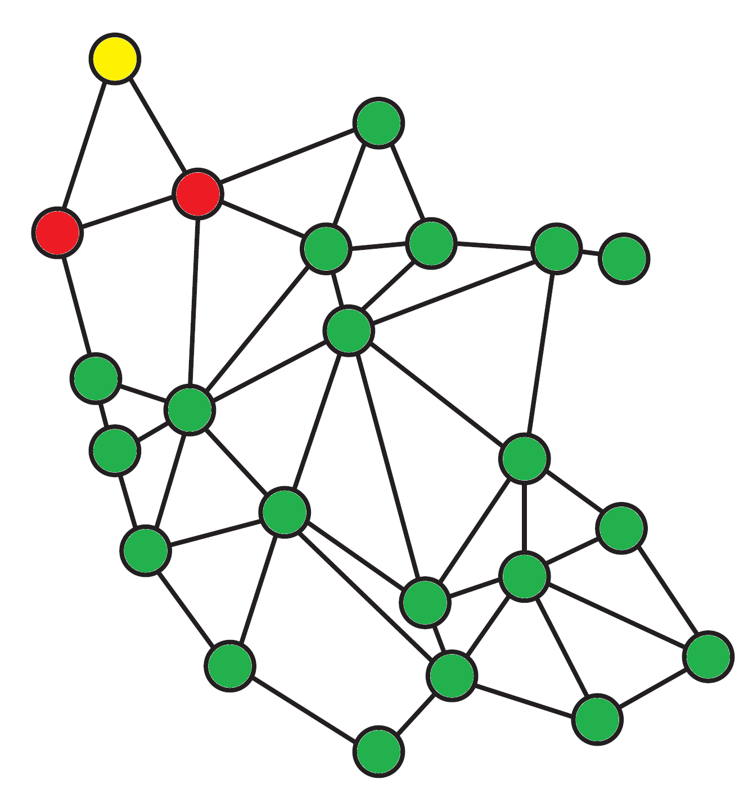

**BST 5610**

**Spatial Epidemiology and Disease Mapping**

**Homework 2**

**Due 11:59 PM, November 4, 2022**

1. (2 Points) Consider the state of Connecticut, which has only 8 counties. Find the num and adj vectors as defined on Slide 21 of DiseaseMapping.pdf. You can do this by hand because Connecticut has only 8 counties

We will assign numbers to counties by their alphabetical order:

1: Fairfield

2: Hartford

3: Litchfield

4: Middlesex

5: New Haven

6: New London

7: Tolland

8: Windham

```{}
num = [2, 5, 3, 3, 4, 4, 3, 2]
adj = [3, 5, 3, 4, 5, 6, 7, 1, 2, 5, 2, 5, 6, 1, 2, 3, 4, 2, 5, 7, 8, 2, 6, 8, 6, 7]
```

2. (2 Points) Use the network of counties in eastern Missouri to illustrate the global Markov property of a GMRF. Color the nodes as necessary and give a brief explanation of which colored nodes are independent of which others conditioned on a particular set of nodes. Your explanation should be brief, like that shown in slides 24 and 25 of DiseaseMapping.pdf.

See Figure 1. Conditioned on the red nodes, the nodes in green are independent of the nodes in yellow and vice versa.



3. (6 Points) For the Pennsylvania lung cancer data, run models

Model 2b: Hierarchical model with Poisson (slide 10)

```{r}
set.seed(11042022)
```

```{r, warning = F, message = F}
library(SpatialEpi)
library(nimble)
library(sp)
library(spdep)
library(tidyverse)
library(tmap)
```

First, we load in and process the data.

```{r}
data(pennLC_sf)
pennLC_sf <- pennLC_sf %>%
  group_by(county) %>%
  summarize(pop = sum(population), cases = sum(cases)) %>%
  mutate(LCrate = cases/pop)
```

Now let's define our model and set up nimble. Relatively uninformative priors were selected where needed, and iterations and burn in time selected for reaching a steady state on parameters of interest.

```{r}
model_2b_code <- nimbleCode({
  for (i in 1:N) {
    y[i] ~ dpois(pop[i]*theta[i])
    log(theta[i]) <- beta_0+v[i]
    v[i] ~ dnorm(0, tau_v)
  }
  beta_0 ~ dnorm(0, 1/10)
  tau_v ~ dgamma(1, 1/10000)
})

model_2b_data <- list(y = pennLC_sf$cases)

model_2b_consts <- list(N = nrow(pennLC_sf), pop = pennLC_sf$pop)

model_2b_inits <- list(beta_0 = 0, v = rep(0, nrow(pennLC_sf)), tau_v = 0.1)

model_2b_model <- nimbleModel(model_2b_code, data = model_2b_data,
                              constants = model_2b_consts, inits = model_2b_inits)
model_2b_compile <- compileNimble(model_2b_model)
model_2b_conf <- configureMCMC(model_2b_compile, print = T, thin = 100)
model_2b_conf$addMonitors(c("beta_0", "tau_v", "theta"))
model_2b_mcmc <- buildMCMC(model_2b_conf)
model_2b_mcmc_compile <- compileNimble(model_2b_mcmc, project = model_2b_model)

model_2b_samples <- runMCMC(model_2b_mcmc_compile, niter = 1100000, nburnin = 100000,
                            inits = model_2b_inits, nchains = 1, samplesAsCodaMCMC = T)
```

Examining posterior sampling distribution for $\beta_0$. It appears we have reached a steady state.

```{r}
ts.plot(model_2b_samples[,"beta_0"], xlab = "iteration", col = "red", lwd = 1.5,
        ylab = expression(beta_0), main = expression(beta_0))
```

Examining posterior sampling distribution for $\tau_v$. It appears we have reached a steady state.

```{r}
ts.plot(model_2b_samples[,"tau_v"], xlab = "iteration", col = "red", lwd = 1.5,
        ylab = expression(tau_v), main = expression(tau_v))
```

We take the posterior mean for each county as our point estimate.

```{r}
model_2b_post_mean <- apply(model_2b_samples[,colnames(model_2b_samples)
                                             [startsWith(colnames(model_2b_samples),
                                                         "theta")]], 2, mean)
model_2b_post_mean
summary(model_2b_post_mean)
```

Let's plot a map of the rate estimates from our model and compare it to the true rates. We can definitely see the Bayesian "shrinkage" happening here, where far data points are pulled back a bit.

```{r}
pennLC_map_breaks <- seq(0.0002, 0.0014, 0.0002)

tm_shape(pennLC_sf) +
  tm_polygons(col = "LCrate", title = "True lung cancer rate",
              breaks = pennLC_map_breaks)
```

```{r}
mutate(pennLC_sf, model_2b_LCrate = model_2b_post_mean) %>%
  tm_shape() +
  tm_polygons(col = "model_2b_LCrate", title = "Model 2b lung cancer rate",
              breaks = pennLC_map_breaks)
```

Model 3a: CAR model with only correlated heterogeneity (slide 28)

First we need to define `num` and `adj` for the CAR model.

```{r}
pennLC_sp <- as(pennLC_sf, "Spatial")
pennLC_nb <- poly2nb(pennLC_sp, queen = F)

num <- map_int(pennLC_nb, length)

adj <- c()
for (i in 1:nrow(pennLC_sp))
  adj <- c(adj, pennLC_nb[[i]])
```

Now we can define the model.

```{r}
model_3a_code <- nimbleCode({
  for (i in 1:N) {
    y[i] ~ dpois(pop[i]*theta[i])
    log(theta[i]) <- beta_0+s[i]
  }
  s[1:N] ~ dcar_normal(adj[1:L], weights[1:L], num[1:N], tau_s, zero_mean = 1)
  beta_0 ~ dnorm(0, 1/10)
  tau_s ~ dgamma(1, 1/10000)
})

model_3a_data <- list(y = pennLC_sf$cases)

model_3a_consts <- list(N = nrow(pennLC_sf), pop = pennLC_sf$pop, adj = adj, num = num,
                        L = length(adj), weights = rep(1, length(adj)))

model_3a_inits <- list(beta_0 = 0, s = rep(0, nrow(pennLC_sf)), tau_s = 0.1)

model_3a_model <- nimbleModel(model_3a_code, data = model_3a_data,
                              constants = model_3a_consts, inits = model_3a_inits)
model_3a_compile <- compileNimble(model_3a_model)
model_3a_conf <- configureMCMC(model_3a_compile, print = T, thin = 100)
model_3a_conf$addMonitors(c("beta_0", "tau_s", "theta"))
model_3a_mcmc <- buildMCMC(model_3a_conf)
model_3a_mcmc_compile <- compileNimble(model_3a_mcmc, project = model_3a_model)

model_3a_samples <- runMCMC(model_3a_mcmc_compile, niter = 1100000, nburnin = 100000,
                            inits = model_3a_inits, nchains = 1, samplesAsCodaMCMC = T)
```

Examining posterior sampling distribution for $\beta_0$. It appears we have reached a steady state.

```{r}
ts.plot(model_3a_samples[,"beta_0"], xlab = "iteration", col = "red", lwd = 1.5,
        ylab = expression(beta_0), main = expression(beta_0))
```

Examining posterior sampling distribution for $\tau_s$. It appears we have reached a steady state.

```{r}
ts.plot(model_3a_samples[,"tau_s"], xlab = "iteration", col = "red", lwd = 1.5,
        ylab = expression(tau_s), main = expression(tau_s))
```

We take the posterior mean for each county as our point estimate.

```{r}
model_3a_post_mean <- apply(model_3a_samples[,colnames(model_3a_samples)
                                             [startsWith(colnames(model_3a_samples),
                                                         "theta")]], 2, mean)
model_3a_post_mean
summary(model_3a_post_mean)
```

Let's plot a map of the rate estimates from our model and compare it to the true rates. The strength of the Bayesian shrinkage is similar to the previous model, but it clearly has picked up on the spatial context in the data.

```{r}
mutate(pennLC_sf, model_3a_LCrate = model_3a_post_mean) %>%
  tm_shape() +
  tm_polygons(col = "model_3a_LCrate", title = "Model 3a lung cancer rate",
              breaks = pennLC_map_breaks)
```

Model 3b: CAR model with both correlated and uncorrelated heterogeneity (slide 36)

Let's define the model.

```{r}
model_3b_code <- nimbleCode({
  for (i in 1:N) {
    y[i] ~ dpois(pop[i]*theta[i])
    log(theta[i]) <- beta_0+s[i]+v[i]
    v[i] ~ dnorm(0, tau_v)
  }
  s[1:N] ~ dcar_normal(adj[1:L], weights[1:L], num[1:N], tau_s, zero_mean = 1)
  beta_0 ~ dnorm(0, 1/10)
  tau_s ~ dgamma(1, 1/10000)
  tau_v ~ dgamma(1, 1/10000)
})

model_3b_data <- list(y = pennLC_sf$cases)

model_3b_consts <- list(N = nrow(pennLC_sf), pop = pennLC_sf$pop, adj = adj, num = num,
                        L = length(adj), weights = rep(1, length(adj)))

model_3b_inits <- list(beta_0 = 0, s = rep(0, nrow(pennLC_sf)),
                       v = rep(0, nrow(pennLC_sf)), tau_s = 0.1, tau_v = 0.1)

model_3b_model <- nimbleModel(model_3b_code, data = model_3b_data,
                              constants = model_3b_consts, inits = model_3b_inits)
model_3b_compile <- compileNimble(model_3b_model)
model_3b_conf <- configureMCMC(model_3b_compile, print = T, thin = 100)
model_3b_conf$addMonitors(c("beta_0", "tau_s", "tau_v", "theta"))
model_3b_mcmc <- buildMCMC(model_3b_conf)
model_3b_mcmc_compile <- compileNimble(model_3b_mcmc, project = model_3b_model)

model_3b_samples <- runMCMC(model_3b_mcmc_compile, niter = 1100000, nburnin = 102000,
                            inits = model_3b_inits, nchains = 1, samplesAsCodaMCMC = T)
```

Examining posterior sampling distribution for $\beta_0$. It appears we have reached a steady state.

```{r}
ts.plot(model_3b_samples[,"beta_0"], xlab = "iteration", col = "red", lwd = 1.5,
        ylab = expression(beta_0), main = expression(beta_0))
```

Examining posterior sampling distribution for $\tau_s$. It appears we have reached a steady state; though there is a noticeable spike where it accepted a really far out there proposal.

```{r}
ts.plot(model_3b_samples[,"tau_s"], xlab = "iteration", col = "red", lwd = 1.5,
        ylab = expression(tau_s), main = expression(tau_s))
```

Examining posterior sampling distribution for $\tau_v$. It appears we have reached a steady state.

```{r}
ts.plot(model_3b_samples[,"tau_v"], xlab = "iteration", col = "red", lwd = 1.5,
        ylab = expression(tau_v), main = expression(tau_v))
```

We take the posterior mean for each county as our point estimate.

```{r}
model_3b_post_mean <- apply(model_3b_samples
                            [,colnames(model_3b_samples)
                              [startsWith(colnames(model_3b_samples),
                                          "theta")]], 2, mean)
model_3b_post_mean
summary(model_3b_post_mean)
```

Let's plot a map of the rate estimates from our model and compare it to the true rates. This model seems to be very similar to the previous. It doesn't look like allowing for some uncorrelated heterogeneity on top of the correlated heterogeneity really adds or changes much.

```{r}
mutate(pennLC_sf, model_3b_LCrate = model_3b_post_mean) %>%
  tm_shape() +
  tm_polygons(col = "model_3b_LCrate", title = "Model 3b lung cancer rate",
              breaks = pennLC_map_breaks)
```
